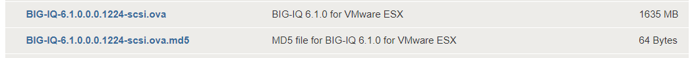

Provision BIG-IQ (VMware)
==============================================================

**Description:**

In this lab, we will deploy both BIG-IQ CM and DCD in VMware ESXi. Refer to below AskF5 link for official documentation. 

`AskF5 Reference <https://support.f5.com/kb/en-us/products/big-iq-centralized-mgmt/manuals/product/big-iq-centralized-management-and-vmware-setup-6-0-0.html>`__

Step 1: VMware ESXi Requirements
----------------------------------------------

The vSphere virtual machine guest environment for the BIG-IQ Virtual Edition (VE), at minimum, must include:

- 4 virtual CPUs
- 16 GB RAM

     - Important: When you provision the amount of RAM allocated to the virtual machine, it must match the amount of reserved RAM.
- 1 VMXNET3 virtual network adapter
- 1 virtual network adapter
- At least 128GB disk

Step 2: Launch Instance
----------------------------------------------

Follow below steps to deploy **2** BIG-IQ CM devices. You can repeat these same steps to deploy your BIG-IQ DCD device(s). 

.. IMPORTANT::
   DCD is required to use analytics, application dashboard, and other visualization features. 

#. Download the BIG-IQ Centralized Manager ova file from `downloads.f5.com <https://downloads.f5.com>`__

     |lab-1-1|

     .. NOTE:: 
        Use the LARGE (500GB) footprint image for your BIG-IQ DCD devices. 

     |lab-1-2|

#. From the ESXi Host Client, click **Create / Register VM**

     |lab-1-3|

#. Select **Deploy a virtual machine from an OVF or OVA file**, click **Next**

     |lab-1-4|

#. Next, drag and drop the ova file you downloaded earlier, enter in a name for the instance and click **Next**

     |lab-1-5|

#. Select your desired storage location and click **Next**

     |lab-1-6|

#. Confirm the EULA by clicking **I agree** and then click **Next**

     |lab-1-7|

#. Select your management and Internal networks (External is optional), select **Thick** provisioning, then click **Next**

     .. NOTE:: 
        In this lab we will use a separate Internal network for communication with the DCD

     |lab-1-8|

#. Confirm your settings then click **Finish**

     |lab-1-9|

#. When provisioning is complete, you will see BIG-IQ appear in the list of virtual machines

     |lab-1-10|

#. After BIG-IQ boots, click on the instance, click **Console** and choose a method to open the console

     |lab-1-11|

#. Log in using the root/default credentials and type in ``config`` to configure the management ip. 

     |lab-1-12|

#. Access the management IP over HTTPS and log in using the default credentials (admin/admin).

