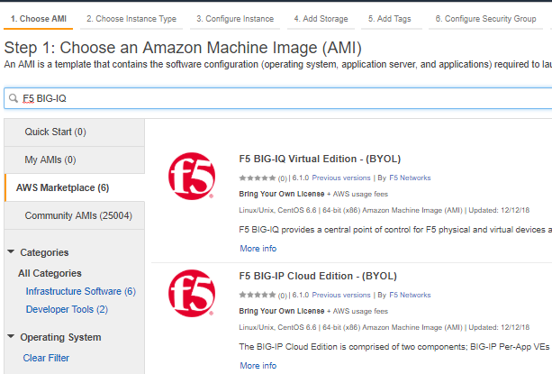

Step 3: Launch Instance
----------------------------------------------

AWS Marketplace

#. Search using keywords "F5 BIG-IQ" 
    Note that "F5 BIG-IQ Virtual Edition" and "F5 BIG-IP Cloud Edition" deploy the same instance of BIG-IQ Centralized Manager. 
    
    |lab-1-1|

    Currently only BYOL is available in AWS
    
    Make sure to accept EULA when launching for first time
        Launch with 2 network interfaces

#. Associate EIP to primary IP of management ENI
#. Log in via SSH to the EIP, using public key authentication and specifying your key pair
#. Change admin password so you can log into GUI
    ``tmsh modify auth password admin``
    ``tmsh save sys config``

