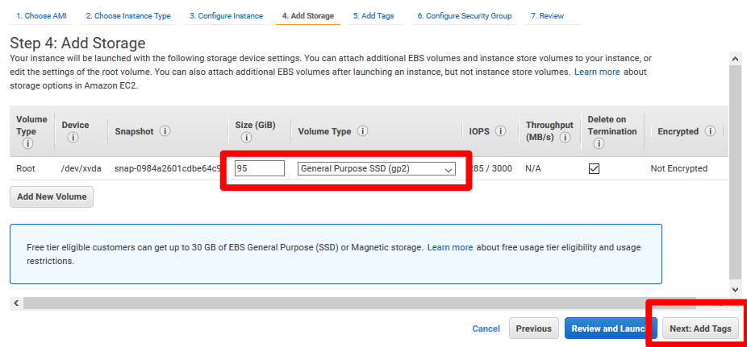
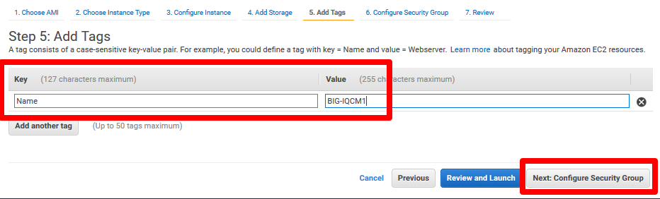
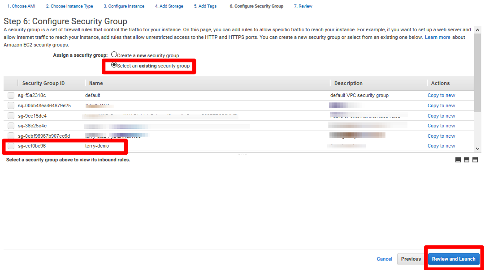

Provision BIG-IQ (AWS)
==============================================================

**Description:**

This lab will deploy both BIG-IQ CM and DCD in AWS cloud. Refer to below AskF5 link if you need further details. 

`AskF5 Reference <https://support.f5.com/kb/en-us/products/big-iq-centralized-mgmt/manuals/product/big-iq-centralized-management-and-amazon-web-services-setup-6-0-0/2.html#guid-0fd6defe-1e5b-4414-bd5b-674a1630b828>`__

Step 1: AWS VPC Requirements
----------------------------------------------

Before you deploy BIG-IQ in AWS, ensure that you meet below requirements:

- An active AWS account
- Access to the AWS Marketplace

..NOTE:: 
  Single or Multi Region is supported

#. IAM user accounts (optional but not required)
#. Key pair (required): `AWS Reference <https://docs.aws.amazon.com/AWSEC2/latest/UserGuide/ec2-key-pairs.html>`__
   .. IMPORTANT::
      Per AWS best practice, this is required to get ssh access to the instance after boot. After login, you can change the admin password for access to the GUI
#. Management subnet (public)
	For BIG-IQ GUI access, data sync between Primary/Secondary
#. External subnet (public)
   - For Elasticsearch Cluster traffic between BIG-IQ CM and BIG-IQ DCD (logging node)
   - For BIG-IP device discovery, management, monitoring
#. Security group configuration
   - Group1= allow-only-ssh-https-ping
   - Group2= allow-all-traffic
#. Internet gateway (for initial BIG-IQ activation)
   - If you cannot allow internet access, you will need to do manual activation for BIG-IQ and BIG-IP pool licenses
#. Route Table configuration (association)
   - To allow access to internet for management and external subnets

Step 2: Launch Instance
----------------------------------------------

Recommended Instance Type:  `m4.xlarge (EBS)
<https://support.f5.com/kb/en-us/products/big-iq-centralized-mgmt/manuals/product/big-iq-centralized-management-and-amazon-web-services-setup-6-0-0/1.html#guid-bd42a26b-9fa6-4127-88ab-fe5ab06bd3c2>`__

Required Network Interfaces:  2

**AWS Marketplace**

#. Search using keywords "F5 BIG-IQ" 
    Note that "F5 BIG-IQ Virtual Edition" and "F5 BIG-IP Cloud Edition" deploy the same instance of BIG-IQ Centralized Manager. 
    
   |lab-1-1|

   .. NOTE:: Currently only BYOL is available in AWS
    
   .. ATTENTION::Make sure to accept EULA when launching for first time
#. Click Continue
   |lab-1-2|
#. Select m4.xlarge, click Next: Configure Instance Details
   |lab-1-3|
#. Enter in "2" for number of instances to provision Primary and Secondary devices. Select your VPC and then management subnet
   |lab-1-4|
#. Launch with 2 network interfaces. Select the External subnet for the additional NIC. Click Review and Launch
   |lab-1-5|
   |lab-1-6|
#. Select SSD, click Next
   |lab-1-7|
#. Click Launch
   |lab-1-8|
#. Associate EIP to primary IP of the management ENI
#. Log in via SSH to the EIP. Use public key authentication and your key that you specified when launching the instances
#. Change admin password so you can log into GUI
   ``tmsh modify auth password admin``
   ``tmsh save sys config``

.. |lab-1-1| image:: images/lab-1-1.png

.. |lab-1-5| image:: images/lab-1-5.png

