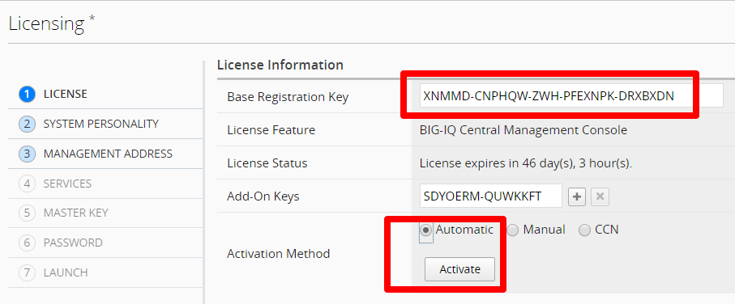
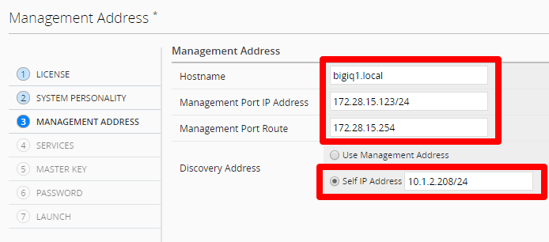
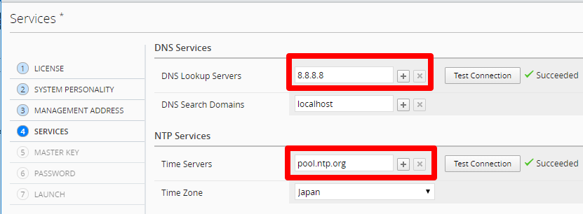
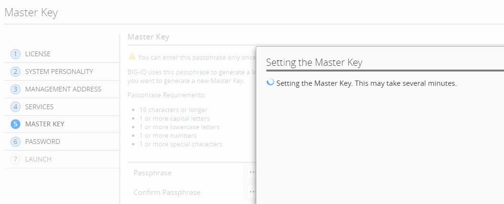
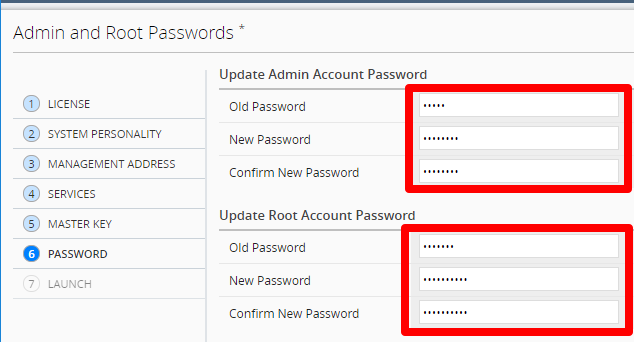
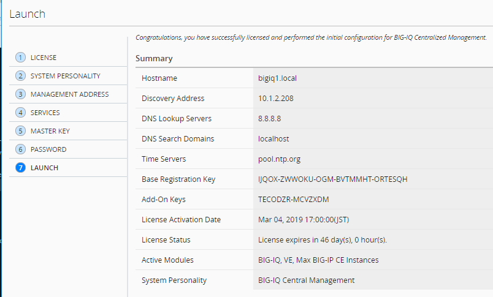

BIG-IQ Setup Wizard (VMware)
==============================================================

**Description:**

In this lab, we will complete the setup wizard for BIG-IQ CM and DCD in Vmware ESXi. Refer to below AskF5 link for official documentation. 

`AskF5 Reference <https://support.f5.com/kb/en-us/products/big-iq-centralized-mgmt/manuals/product/big-iq-centralized-management-plan-implement-deploy-6-1-0/03.html#guid-37a1f866-5f56-45bb-914f-f24dbd3348d0>`__

Step 1: Setup Wizard 
----------------------------------------------

Follow below steps to setup both BIG-IQ CM and DCD devices. The only difference will be step (2) below.

#. When you first log into the BIG-IQ, you must complete the setup wizard. The first step is licensing. Enter in the Base Registration Key for your BIG-IQ CM, click **agree** to accept EULA and activate. Click **Next** to proceed to the next step

   .. NOTE::
      If you cannot configure Internet access, use Manual activation

   |lab-1-1|

#. Select **BIG-IQ Central Management** for CM. Select **BIG-IQ Data Collection Device** when configuring your logging node, click **Next**

   |lab-1-2|

#. Specify the first BIG-IQ Hostname, Management Port IP Address, Management Port Route. Select Self-IP for discovery address (recommended) and enter an IP address from the internal subnet configured for your second network adapter in ESXi, click **Next**

   |lab-1-3|

#. Configure your DNS, Time Server, and set your Time Zone, click **Next**

   |lab-1-4|

#. Set Master key: <Strong password>, click **Next**

   |lab-1-5|

   .. IMPORTANT::
         If this BIG-IQ is part of an HA or DCD configuration, make sure you keep track of the pass phrase, because it cannot be recovered if you lose it.

#. Enter in the default (admin/admin, root/default) and new passwords for admin and root, click **Next**

   |lab-1-6|

#. Confirm configuration and Launch

   |lab-1-7|

.. |lab-1-2| image:: images/lab-1-2.png

