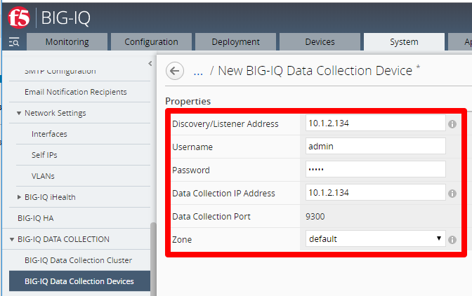
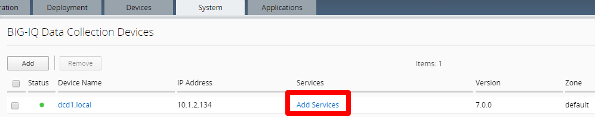
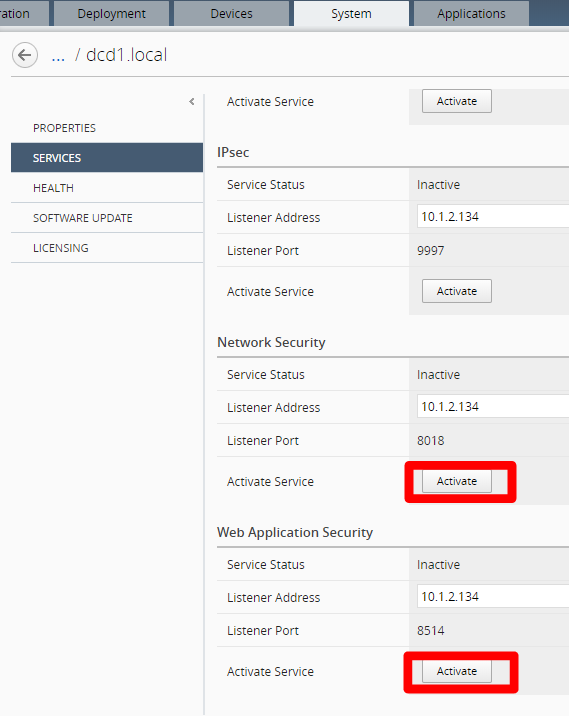

BIG-IQ Setup Wizard (VMware)
==============================================================

**Description:**

In this lab, we will complete the setup wizard for BIG-IQ CM and DCD in Vmware ESXi. You will then discover the DCD and activate service you want to monitor. 
Refer to below AskF5 link for official documentation. 

`AskF5 Reference <https://techdocs.f5.com/en-us/bigiq-7-0-0/planning-and-implementing-big-iq-deployment/deploying-a-big-iq-system.html#GUID-37A1F866-5F56-45BB-914F-F24DBD3348D0>`__

Step 1: Setup Wizard 
----------------------------------------------

Follow below steps to setup both BIG-IQ CM and DCD devices. The only difference will be step (2) below.

#. When you first log into the BIG-IQ, you must complete the setup wizard. The first step is licensing. Enter in the Base Registration Key for your BIG-IQ CM, click **agree** to accept EULA and activate. Click **Next** to proceed to the next step

   .. NOTE::
      If you cannot configure Internet access, use Manual activation

   |lab-1-1|

#. Select **BIG-IQ Central Management** for CM. Select **BIG-IQ Data Collection Device** when configuring your logging node, click **Next**

   |lab-1-2|

#. Specify the first BIG-IQ Hostname, Management Port IP Address, Management Port Route. Select Self-IP for discovery address (recommended) and enter an IP address from the internal subnet configured for your second network adapter in ESXi, click **Next**

   |lab-1-3|

#. Configure your DNS, Time Server, and set your Time Zone, click **Next**

   |lab-1-4|

#. Set Master key: <Strong password>, click **Next**

   |lab-1-5|

   .. IMPORTANT::
         If this BIG-IQ is part of an HA or DCD configuration, make sure you keep track of the pass phrase, because it cannot be recovered if you lose it.

#. Enter in the default (admin/admin, root/default) and new passwords for admin and root, click **Next**

   |lab-1-6|

#. Confirm configuration and Launch

   |lab-1-7|

#. Once your DCD setup is complete. Make sure you discover it on your CM device. Click **System** > **BIG-IQ DATA COLLECTION** > **BIG-IQ Data Collection Devices** > click **Add** 

   |lab-1-8|

   - Use the DCD self-ip for the **Discovery/Listener Address**
   - Use the admin username and password
   - Use the DCD self-ip as the **Data Collection IP Address**

   For more info about discovering a DCD device, see the `AskF5 Reference <https://techdocs.f5.com/en-us/bigiq-7-0-0/planning-and-implementing-big-iq-deployment/deploying-a-data-collection-device.html#GUID-8B0472C1-16CF-4D9A-9D38-DC592368BB20>`__

#. After you discover the DCD device, activate the services you want to monitor. Click **Add Services** 

   |lab-1-9|

#. Confirm that the Listener Address specifies the correct self-IP address on the data collection device, then click **Activate** for every service you want to add 

   |lab-1-10|

This completes the BIG-IQ CM and DCD setup. 

.. |lab-1-1| image:: images/lab-1-1.png
.. |lab-1-2| image:: images/lab-1-2.png
.. |lab-1-3| image:: images/lab-1-3.png
.. |lab-1-4| image:: images/lab-1-4.png
.. |lab-1-5| image:: images/lab-1-5.png
.. |lab-1-6| image:: images/lab-1-6.png
.. |lab-1-7| image:: images/lab-1-7.png

