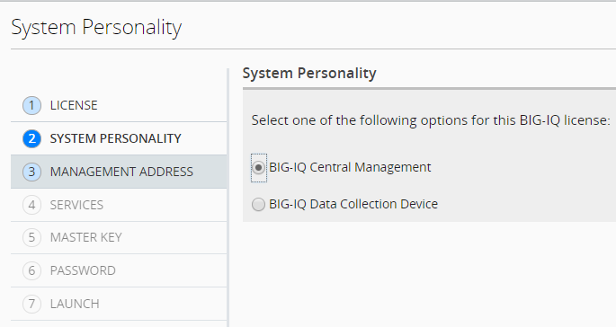

Step 1: Setup Wizard 
----------------------------------------------

#. License

    |lab-1-1|

#. Select "BIG-IQ Central Management" for CM, and the other for logging node

    |lab-1-2|

#. Select Self-IP for discovery address (recommended)

    |lab-1-3|

#. Services

    |lab-1-4|

#. Master key: <Long password>

    |lab-1-5|

#. Skip changing the password for admin, just set root

    |lab-1-6|

#. Launch

    |lab-1-7|

.. |lab-1-1| image:: images/lab-1-1.png

.. |lab-1-3| image:: images/lab-1-3.png
.. |lab-1-4| image:: images/lab-1-4.png
.. |lab-1-5| image:: images/lab-1-5.png
.. |lab-1-6| image:: images/lab-1-6.png
.. |lab-1-7| image:: images/lab-1-7.png