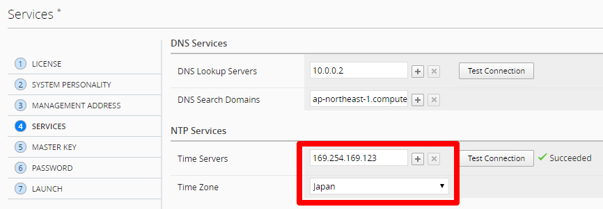
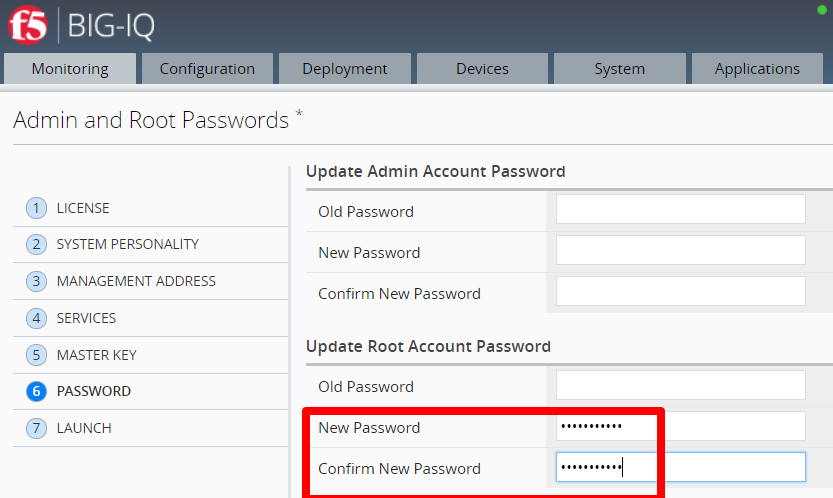

BIG-IQ Setup Wizard (AWS)
==============================================================

**Description:**

In this lab, we will complete the setup wizard for BIG-IQ CM and DCD in AWS cloud. Refer to below AskF5 link if you need further details. 

`AskF5 Reference <https://techdocs.f5.com/en-us/bigiq-7-0-0/planning-and-implementing-big-iq-deployment/deploying-a-big-iq-system.html#GUID-37A1F866-5F56-45BB-914F-F24DBD3348D0>`__

Step 1: Setup Wizard 
----------------------------------------------

Follow below steps to setup your BIG-IQ CM and DCD devices. The only difference will be step (2) below.

#. When you first log into the BIG-IQ, you must complete the setup wizard. The first step is licensing. Enter in the Base Registration Key for your BIG-IQ CM, accept EULA and activate. 

   .. NOTE::
      If you cannot configure Internet access, use Manual activation

   |lab-1-1|

#. Select **BIG-IQ Central Management** for CM. Select **BIG-IQ Data Collection Device** when configuring your logging node

   |lab-1-2|

#. In AWS, the Hostname, Management Port IP Address, Management Port Route are automatically set by DHCP. Select Self-IP for discovery address (recommended) and enter in the internal IP assigned to your second network interface using the appropriate netmask

   |lab-1-3|

#. Configure your Time Server using Amazon Time Sync Service and set your time zone 

   |lab-1-4|

#. Set Master key: <Long password>

   |lab-1-5|

#. Skip changing the password for admin, just set root

   |lab-1-6|

#. Confirm configuration and Launch

   |lab-1-7|

#. Once your DCD setup is complete. Make sure you discover it on your CM device. Click **System** > **BIG-IQ DATA COLLECTION** > **BIG-IQ Data Collection Devices** > click **Add** 

   |lab-1-8|

   - Use the DCD self-ip for the **Discovery/Listener Address**
   - Use the admin username and password
   - Use the DCD self-ip as the **Data Collection IP Address**

#. After you discover the DCD device, activate the services you want to monitor. Click **Services** 

#. Confirm that the Listener Address specifies the correct self-IP address on the data collection device, then click **Activate** for every service you want to add 

   |lab-1-9|

.. |lab-1-1| image:: images/lab-1-1.png
.. |lab-1-2| image:: images/lab-1-2.png
.. |lab-1-3| image:: images/lab-1-3.png

.. |lab-1-5| image:: images/lab-1-5.png

.. |lab-1-7| image:: images/lab-1-7.png
.. |lab-1-8| image:: images/lab-1-8.png
