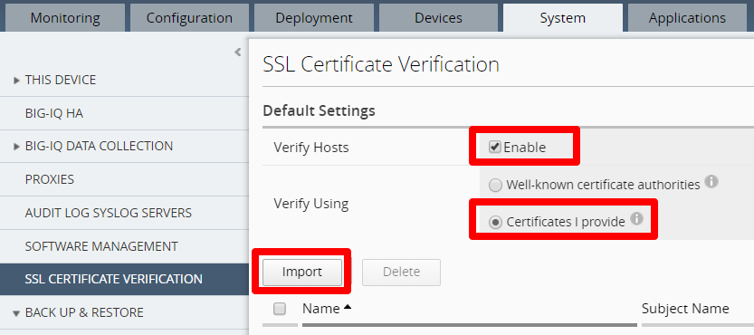
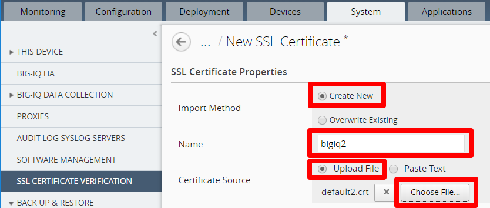
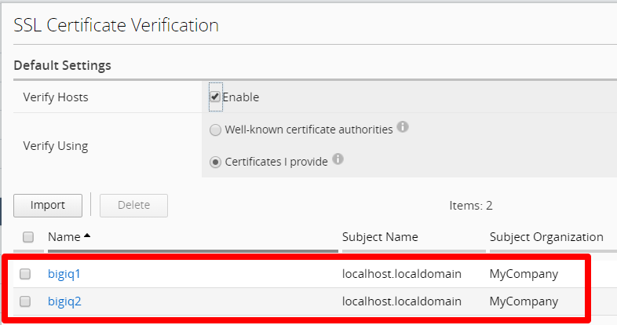
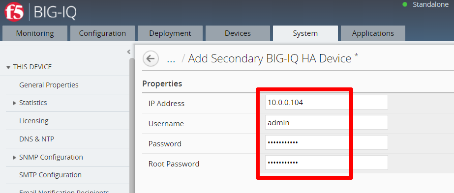
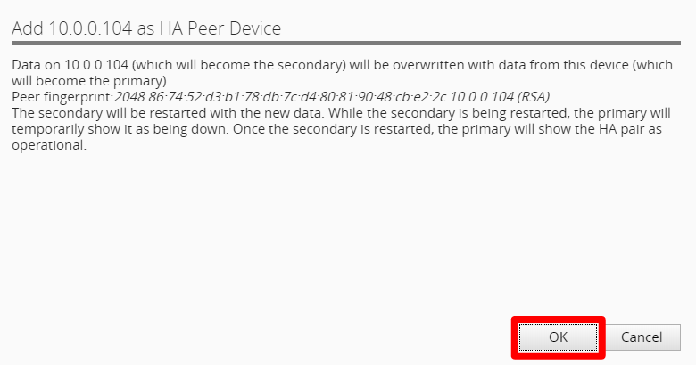

High Availability (VMware and AWS) 
==============================================================

**Description**

In this lab, we will configure High Availability for BIG-IQ CM. Refer to below AskF5 link if you need further details. 

`AskF5 Reference <https://support.f5.com/kb/en-us/products/big-iq-centralized-mgmt/manuals/product/big-iq-centralized-management-plan-implement-deploy-6-1-0/04.html#ch-managing-a-big-iq-system>`__

Step 1: Add BIG-IQ primary and secondary SSL certificates to the primary BIG-IQ
----------------------------------------------
Before you create a BIG-IQ high availability pair, you should add the SSL certificates for both BIG-IQ systems to what will be the primary BIG-IQ. This is required for both BIG-IQ systems to communicate with your managed devices, regardless of which BIG-IQ system is active.

First, you must download the default SSL certificates of the primary and secondary BIG-IQ. 

#. Access both BIG-IQ devices via ssh client

#. Navigate to ``/config/httpd/conf/ssl.crt/server.crt`` and download the **server.crt** file 

   |lab-1-1|

#. On the primary BIG-IQ, click System > SSL CERTIFICATE VERIFICATION > click **Import** to upload the certificates

   |lab-1-2|

#. Select **Create New**, enter in a unique name for each certificate, click **Choose File...** to select the certificate you downloaded earlier. Click **Save & Close** then **Close** when uploading completes

   |lab-1-3|

   |lab-1-4|

#. Confirm the uploaded certificates

   |lab-1-5|

Step 2: High Availability
----------------------------------------------

For the high availability pair to synchronize properly, each system must be running the same BIG-IQ version, and the clocks on each system must be synchronized to within 60 seconds.

#. Click **System** > **BIG-IQ HA** > Add Secondary and enter in the Secondary connectivity information

   |lab-1-6|

   - Use self-ip of peer BIG-IQ
   - Enter in root password that you configured in the setup wizard (required)

#. Click **OK** to add the HA Peer Device 

   |lab-1-7|

.. |lab-1-1| image:: images/lab-1-1.png

