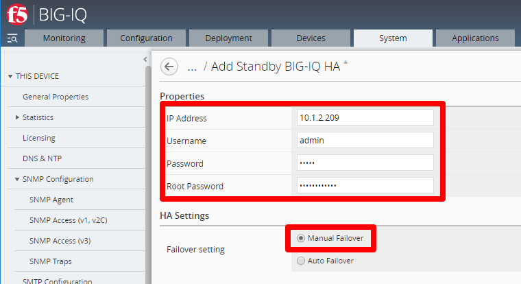

High Availability - Manual (VMware and AWS) 
==============================================================

**Description**

In this lab, we will configure High Availability (Manual) for BIG-IQ CM. Refer to below AskF5 link if you need further details. 

`AskF5 Reference <https://techdocs.f5.com/en-us/bigiq-7-0-0/planning-and-implementing-big-iq-deployment/managing-a-big-iq-system.html#GUID-89348602-0F86-4B77-B905-393F0B2C554B>`__

Step 1:  High Availability - Manual
----------------------------------------------

For the high availability pair to synchronize properly, each system must be running the same BIG-IQ version, and the clocks on each system must be synchronized to within 60 seconds.

#. Click **System** > **BIG-IQ HA** > **Add Secondary** and enter in the secondary device connectivity information

   |lab-1-1|

   - Use self-ip of peer BIG-IQ. Depending on your network configuration you may use the management-ip instead.
   - Enter in admin and root password that you configured in the setup wizard (required)
   - Click **Manual Failover** 

#. Click **Add** to add the HA Peer Device 

This completes the BIG-IQ High Availability (Manual) configuration. 

