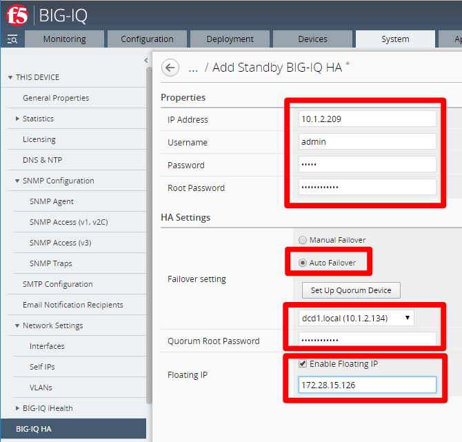
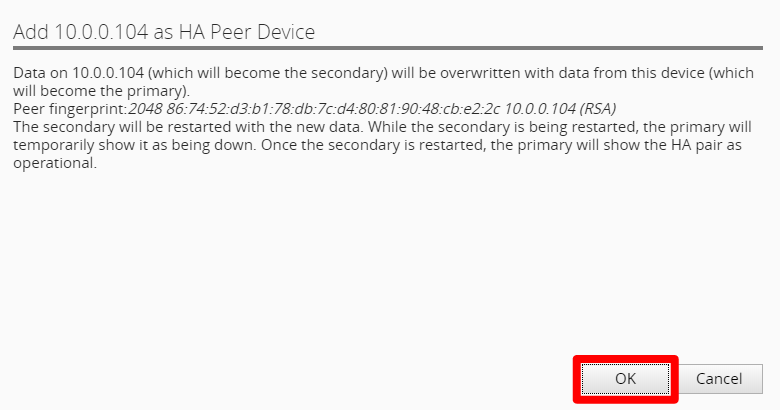

High Availability (AWS)
==============================================================

**Description:**

In this lab, we will High Availability for BIG-IQ CM. Refer to below AskF5 link if you need further details. 

`AskF5 Reference https://support.f5.com/kb/en-us/products/big-iq-centralized-mgmt/manuals/product/big-iq-centralized-management-plan-implement-deploy-6-1-0/04.html#ch-managing-a-big-iq-system>`__

Step 1: High Availability
----------------------------------------------

.. NOTE::
   Currently High Availability only provides configuration sync, not automatic failover. 

#. Prior to HA configuration, log into both Primary and Secondary BIG-IQ CM CLI and run below commands:

  - ``tmsh modify sys db systemauth.disablerootlogin value false``
  - ``tmsh save sys config``
  
#. Click System > BIG-IQ HA > Add Secondary and enter in the Secondary connectivity information

   |lab-1-1|

   - Use self-ip of peer BIG-IQ
   - Enter in root password that you configured in the setup wizard (required)

#. Click "OK" to add the HA Peer Device 

   |lab-1-2|

