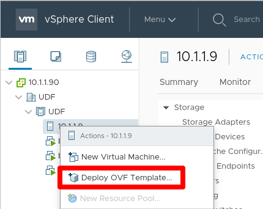

Add Data Collection Device  (VMware and AWS) 
==============================================================

**Description**

In this lab, we will discover and activate a data collection device (DCD). Refer to below AskF5 link if you need further details. 

`AskF5 Reference <https://support.f5.com/kb/en-us/products/big-iq-centralized-mgmt/manuals/product/big-iq-centralized-management-plan-implement-deploy-6-1-0/05.html#guid-09a6ef43-24f5-489d-a012-52d30309b7b9>`__

Step 1: Discover and activate a DCD
----------------------------------------------

Repeat these steps for each DCD you want to configure. It is recommended to have 3 in production environments.

#. Click **System** > **BIG-IQ DATA COLLECTION** > **BIG-IQ Data Collection Devices** then click **Add**

   |lab-1-1|

#. Input the required info to add a DCD then click **Save & Close**

     - **Discovery/Listener Address**: the self IP address for the DCD
     - **Username**: admin user
     - **Password**: admin password
     - **Data Collection IP Address**: the self IP address for the DCD. Use a different self IP address if you are separating the VLAN used for inter-DCD communication
     - **Data Collection Port**: the port used for internal polling and communication between DCDs. This cannot be changed and must be open on any firewall or security group used
     - **Zone**: leave default for single zone DCD cluster. Create custom zones if you are deploying DCDs in different regions for disaster recovery

   |lab-1-2|

   |lab-1-3|

#. By default, the DCD will monitor ADC services. To monitor additional services like Web Application Security, click **Add Services**. You must do this for each DCD

   |lab-1-4|

#. Click **Activate** for every service you want to monitor

   |lab-1-5|

This completes DCD setup. 

.. |lab-1-4| image:: images/lab-1-4.png
.. |lab-1-5| image:: images/lab-1-5.png