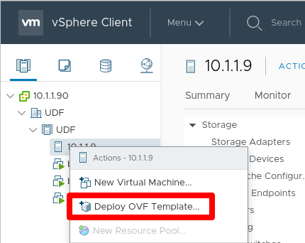
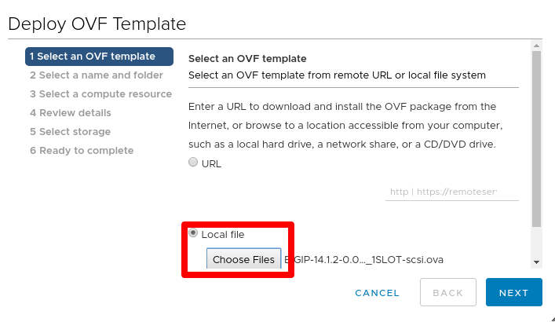
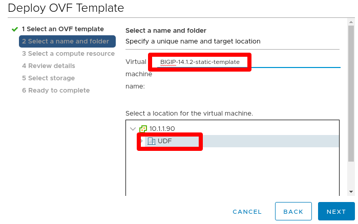
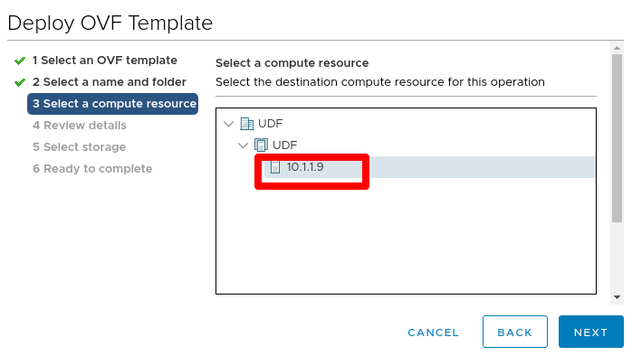
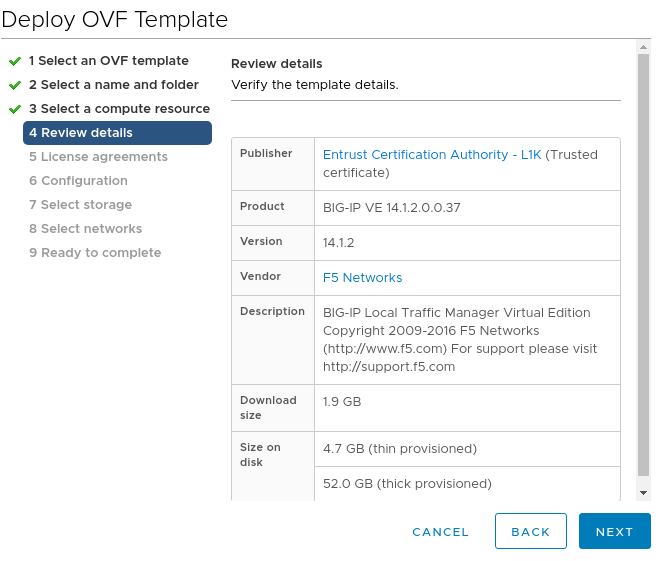
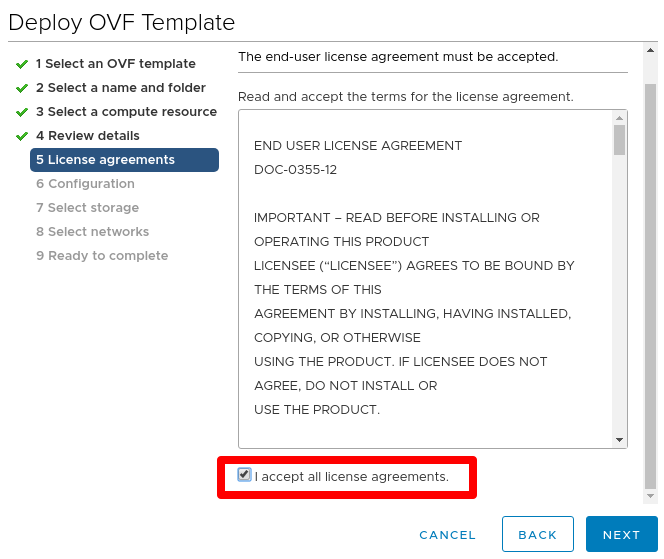
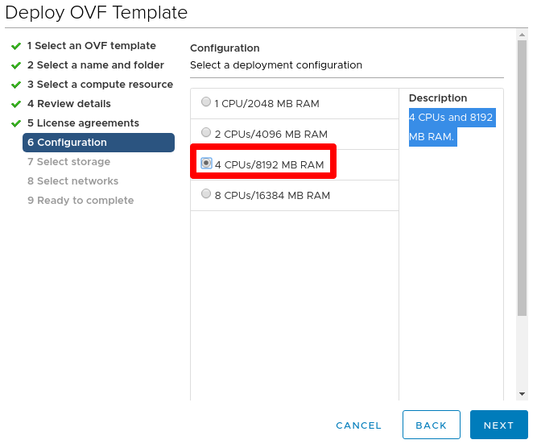
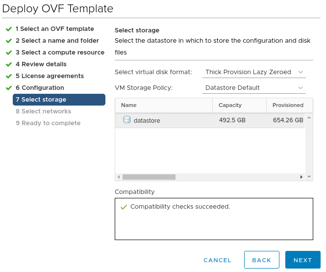
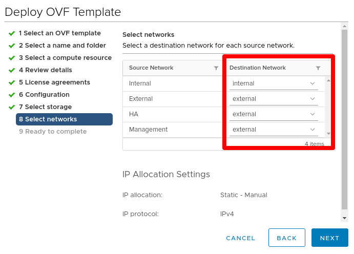
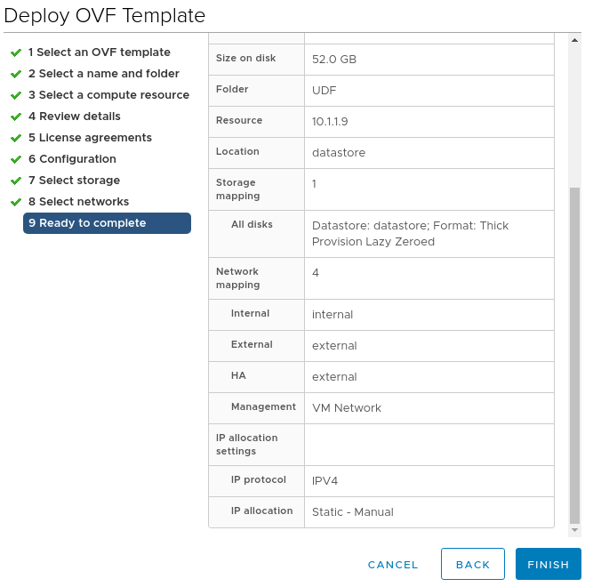

BIG-IP Template Creation - IP Pools/Static (VMware) 
==============================================================

**Description**

In this lab, we will create templates used for provisioning BIG-IP with Static IPs from BIG-IQ CM. Refer to below AskF5 links if you need further details. 

`AskF5 Reference <https://techdocs.f5.com/en-us/bigiq-7-0-0/add-configure-big-ip-ve-in-vmware-environment/add-configure-big-ip-ve-in-vmware-environment.html>`__

`F5 Clouddocs Reference <https://clouddocs.f5.com/training/community/big-iq-cloud-edition/html/class5/module7/module7.html>`__

Step 1:  Download BIG-IP ova image 
----------------------------------------------

#. Access https://downloads.f5.com/

#. Navigate to your desired BIG-IP version and from the Virtual-Edition list of images, select the BIGIP-<version>.ALL_1SLOT-vmware.ova. In test environments, this image will help to save on disk space. 

Step 2:  Deploy and Boot OVA file
----------------------------------------------

#. Right click the host or folder and select **Deploy OVF Template...**

   |lab-1-1|

#. Select **Local file** > click **Choose Files** > select the downloaded ova file

   |lab-1-2|

#. Specify a unique name and target location for the template 

   |lab-1-3|

#. Select the destination compute resource for the template 

   |lab-1-4|

#. Review details 

   |lab-1-5|

#. Review EULA and check **I accept all license agreements.** 

   |lab-1-6|

#. Select **4 CPUs/8192 MB RAM** (this can be adjusted as needed depending on what you provision and configure on BIG-IP)

   |lab-1-7|

#. Leave default storage configuration 

   |lab-1-8|

#. For networks, ensure that the **Management** NIC is associated with the network that has DHCP disabled and confirm other NIC networks. You can ignore the IP allocation settings 

   |lab-1-9|

#. Review all settings and click **Finish** to deploy  

   |lab-1-10|

#. Power on device

Step 2:  Prepare BIG-IP to be a clone instance, and shutdown
----------------------------------------------

`AskF5 Reference <https://support.f5.com/csp/article/K44134742>`__

#. Open the web console and log into device using default credentials (root/default). Change password to a strong password as required from v14.1.0

#. Delete f5-rest-device-id directory file. This forces the REST device ID files to be uniquely generated the next time you start the clone
   
   ``rm -f /config/f5-rest-device-id``

#. Delete the BIG-IP VE clone instance-generated SSH keys

    | ``rm -f /config/ssh/ssh_host_*``
    | ``rm -f /shared/ssh/ssh_host_*``

#. (BIG-IP 14.1.0 and later only) Reset the device administrative account passwords to their default values

    | ``echo "root:default" | chpasswd``
    | ``echo "admin:admin" | chpasswd``

#. From tmsh prompt, disable DHCP for management IP and save configuration

    | ``modify sys global-settings mgmt-dhcp disable``
    | ``save sys config``

#. Power off the BIG-IP VE clone template instance

    ``shutdown -h now``

This completes the BIG-IP Template Creation - DHCP. 

